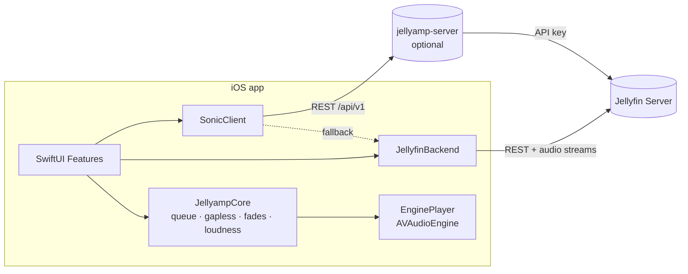

# Architecture

Jellyamp is a monorepo with two deployable artifacts:

1. **iOS app** (`ios/`) — SwiftUI, talks to a Jellyfin server.
2. **jellyamp-server** (`server/`) — optional, self-hosted Docker companion that
   adds audio-embedding-based "sonic" features Jellyfin doesn't have.

## Module map (iOS)

| Module | Platform | Tested on Linux | Responsibility |
|---|---|---|---|
| `JellyampCore` | any (Foundation only) | ✅ | Models, play queue, crossfade/loudness/silence math, gapless planning, direct-vs-transcode decision, playback-report state machine, lyrics timeline, settings models, store protocols |
| `JellyfinBackend` | any | ✅ | Maps Jellyfin API (via jellyfin-sdk-swift) to Core models; stream/image URL builders; playback reporting |
| `SonicClient` | any | ✅ | `SonicProviding` protocol, REST client for jellyamp-server, Jellyfin-only fallback provider, server discovery |
| App shell `ios/Jellyamp` | iOS | ❌ (CI on macOS) | SwiftUI views, AVAudioEngine player, GRDB persistence, downloads, MediaPlayer/CarPlay/Siri integration |

**Rule:** the app shell stays thin. Anything that can be expressed without
Apple frameworks lives in a package and gets unit tests that run on Linux.

## Dependency injection

`DependencyContainer` (app shell) wires protocols to live implementations at
launch:

- `MusicLibraryProviding` → `MusicLibraryAPI` (online) wrapped in an offline
  decorator that serves downloaded items when the server is unreachable.
- `PlayerEngine` → `EnginePlayer` (AVAudioEngine).
- `SonicProviding` → `SonicAPIClient` if `SonicServerDiscovery` finds a healthy
  jellyamp-server, else `JellyfinFallbackSonicProvider`.

Features never check "is the backend installed?" — they read
`SonicCapabilities` (from `GET /api/v1/info` or the fallback's static set) and
hide affordances whose capability is absent (e.g. Sonic Adventure without a
backend).

## Data flow: playing an album

1. UI asks `MusicLibraryProviding` for album tracks → Core `Track` models
   (including codec/bitrate/`NormalizationGain` from Jellyfin).
2. `PlayQueue` is loaded; `PlaybackProfile` decides direct-play vs transcode per
   track from codec + network + settings; `StreamURLBuilder` produces the
   `/Audio/{id}/universal` URL.
3. `EnginePlayer` asks `StreamingAssetCache` for a progressively downloaded
   local file, decodes PCM, applies `GaplessPlan` (silence-trimmed frame
   ranges), schedules sample-accurately on alternating player nodes, applies
   `LoudnessMath` gain and `CrossfadeCurve` ramps.
4. `PlaybackReporter` (Core state machine) emits start/progress/stop events;
   `PlaybackReportingAPI` posts them to `/Sessions/Playing*` so Jellyfin tracks
   play counts and resume state.

## Persistence

GRDB/SQLite in the app shell (see ADR-0003): `artists`, `albums`, `tracks`,
`genres`, `playlists`, `track_fts` (FTS5 search), `downloads`, `play_history`,
`pinned_mixes`. Store protocols (`MetadataStoring`, `DownloadStoring`,
`SettingsStoring`) live in JellyampCore with in-memory fakes for tests.
Credentials and tokens live in the Keychain.

## The hybrid seam (companion backend optional)

`docs/SONIC-API.md` is the contract. Both sides are tested against the same
JSON fixtures (`server/tests/fixtures/` ↔ `SonicClientTests`), so the iOS
client can be developed before the backend ships and the contract cannot drift
silently.
